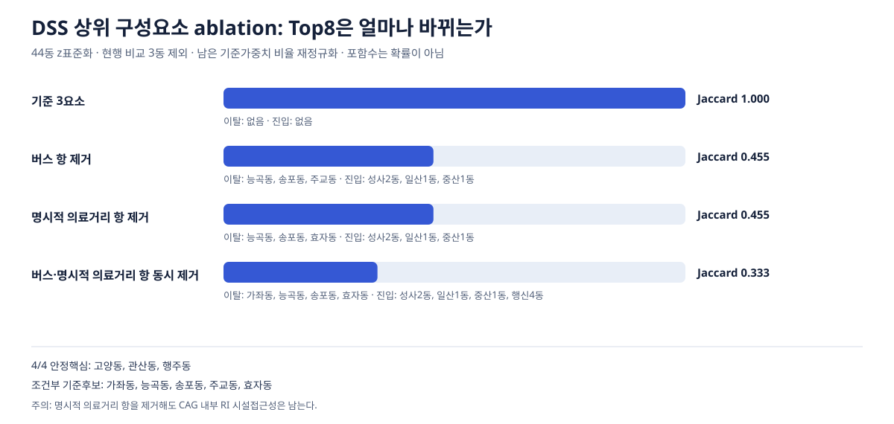
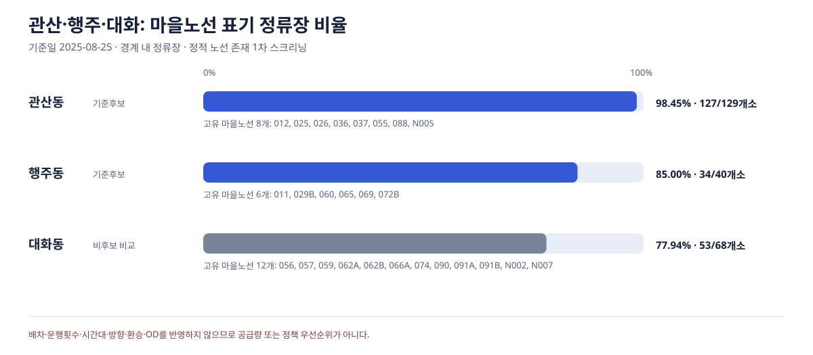

# 고양시 정책대시보드 전문 분석 진단 명세

## 1. 목적과 의사결정 질문

기준 대리모형 `poster_proxy_v1`과 후보 8개 집합은 바꾸지 않는다. 이 분석은 **후보 8개가 어떤 명세에서 유지되는지, 추상 지표를 어떤 현장확인 질문으로 바꿀지, 기존 공간·백테스트 주장의 반증 조건이 무엇인지** 확인한다.

- 기준 후보: 가좌동, 고양동, 관산동, 능곡동, 송포동, 주교동, 행주동, 효자동
- 분석 단위: 고양시 44개 행정동, 후보선정 가능 집합 41개 동(현행 비교 3동 제외)
- 타깃: 독립적인 예측 타깃 없음. `candidate_top8`은 기준모형 산출값, `current_drt_flag`는 정책 사후 팀 매핑이다.
- ID: `adm_cd2`는 결합·추적에만 사용하며 점수 입력에 넣지 않는다.

## 2. 데이터 품질·기간·단위

- 행안부 인구·1인세대: 2026-06-30
- HIRA 병의원등·약국: 2026-06-30, 1,893개
- 버스정류장: 2025-08-25
- 분석 행정경계: 2026-04-01
- 100m 면적격자: 26,595개
- 혼합시점이므로 2026년 동시점 접근성이나 실제 고양온돌 대상자의 이동으로 해석하지 않는다.

## 3. 분석 1 — 명시한 제한 범위 가중치 진단과 경계감사

```text
DSS(w) = w_cag*z(CAG) + w_bus*z(버스비효율) + w_facility*z(의료시설 평균 최근접거리)
w_cag 0.30~0.70, w_bus 0.15~0.50, w_facility 0.10~0.40, 0.05 간격, 합계 1
```

44동 전체에서 각 구성요소를 z표준화한 뒤 현행 비교 3동만 상위8 선정에서 제외했다. 명시한 제한 범위에서 결정적으로 생성되는 시나리오는 **45개**, 기준 후보와의 최저 Jaccard는 **0.454545**다.

- 45/45 포함 기준후보: 가좌동, 고양동, 관산동, 주교동, 행주동
- 조건부 포함 기준후보: 능곡동, 송포동, 효자동
- 후보별 포함수: 가좌동 45/45, 고양동 45/45, 관산동 45/45, 능곡동 37/45, 송포동 31/45, 주교동 45/45, 행주동 45/45, 효자동 42/45

포함비율은 확률·선정 가능성이 아니다. 기준 50·30·20 시나리오와 후보 8개를 그대로 보존한 제한 범위 스트레스 진단이다. 이 범위는 분석자가 명시한 선택이므로 결과가 범위 경계에 의존하는지 별도로 감사했다.

### 3.1 전체 비음수 simplex 경계감사

```text
w_cag, w_bus, w_facility ∈ [0, 1], 0.05 간격, 합계 1
```

전체 비음수 simplex의 **231개** 조합을 추가 계산한 결과, 최저 Jaccard는 **0.333333**이고 **231/231에 포함된 기준후보는 고양동**뿐이다.

- 조건부 기준후보: 가좌동, 관산동, 능곡동, 송포동, 주교동, 행주동, 효자동
- 후보별 포함수: 가좌동 217/231, 고양동 231/231, 관산동 124/231, 능곡동 189/231, 송포동 167/231, 주교동 182/231, 행주동 206/231, 효자동 200/231
- 제한 범위 밖에서 진입한 동: 대덕동, 성사2동, 원신동, 일산1동, 장항1동, 중산1동, 행신4동

전체 simplex는 0 또는 1의 극단 가중치까지 포함하므로 **실제 정책에서 타당한 가중치 집합이 아니다**. 45개 제한 범위에서 보인 안정성이 경계 선택과 무관하다는 주장을 반증하기 위한 감사층이며, 기준 후보 8개나 45개 결과를 대체하지 않는다.

## 4. 분석 2 — 의료 최근접거리 면적격자 커버리지

```text
거리 임계값 = 시간(분) × 60 × 0.8m/s
coverage_t = 동의 100m 격자 중 nearest_facility_m <= 거리 임계값인 격자 비율
```

| 그룹 | 동 수 | 5분 | 10분 | 15분 | 30분 | 평균 최근접거리 중앙값 | P90 중앙값 |
|---|---:|---:|---:|---:|---:|---:|---:|
| 후보 | 8 | 0.046 | 0.123 | 0.218 | 0.530 | 1397.9m | 2375.1m |
| 비후보 | 36 | 0.428 | 0.788 | 0.976 | 1.000 | 303.1m | 598.7m |

이는 동일면적 격자 비율이지 주민 비율이 아니다. 후보식에 의료거리 구성요소가 있어 후보/비후보 차이는 독립 검증이 아니라 담당자 해석을 위한 단위 변환이다.

## 5. 분석 3 — 공간가중행렬 강건성

모든 명세는 Global Moran, 조건부 Local Moran, 9,999회, `seed=42`, 양측 simulation-mean 편차, 44개 BH-FDR을 동일하게 사용한다.

| 명세 | Moran I | 양측 p | FDR HH | FDR LL |
|---|---:|---:|---|---|
| queen | 0.295743 | 0.0007 | 관산동 | 마두1동, 장항2동, 정발산동, 주엽1동, 주엽2동 |
| symmetricKnn4 | 0.247903 | 0.0028 | 없음 | 없음 |
| symmetricKnn6 | 0.191599 | 0.0059 | 없음 | 마두1동, 장항1동, 정발산동, 주엽1동 |

Queen에서 유의한 관산동 HH가 centroid kNN에서 유지되지 않으면 “공간적으로 검증된 HH”가 아니라 **Queen 명세에서만 FDR 유의**라고 제한한다.

## 6. 분석 4 — 현행 3동 임의 top3 중첩 정확 기준선

```text
X ~ Hypergeometric(N=44, K=3, n=3)
P(X=x) = C(3,x) C(41,3-x) / C(44,3)
```

- 기준 DSS top3: 가좌동, 효자동, 고봉동
- 현행 매핑과 관측 중첩: 1곳
- 무작위 기대 중첩: 0.204545곳
- `P(X >= 1)`: 0.195107

현행 3동은 사후 팀 매핑이므로 이 값은 예측성능이 아니라 우연 중첩 기준선이다.

## 7. 분석 5 — 수요정의·HIRA 시설계층 단일축 견고성

| 시나리오 | 변경축 | 기준 후보 Jaccard | 이탈 | 진입 |
|---|---|---:|---|---|
| baseline_all_hira | baseline | 1.000 | 없음 | 없음 |
| demand_corrected_65plus | demandDefinition | 1.000 | 없음 | 없음 |
| demand_without_single70 | demandDefinition | 1.000 | 없음 | 없음 |
| facility_medical_only | facilityLayer | 1.000 | 없음 | 없음 |
| facility_pharmacy_only | facilityLayer | 1.000 | 없음 | 없음 |

한 번에 한 축만 바꿨으므로 수요정의와 시설계층의 상호작용까지 증명하지 않는다. 약국·병의원등은 실제 62개 돌봄서비스와 동일하지 않다.

## 8. 분석 6 — DSS 구성요소 의존성

44개 행정동에서 DSS 상위 구성요소의 Pearson·Spearman과 VIF를 함께 계산했다.

| 구성요소 A | 구성요소 B | Pearson r | Spearman rho | `|rho|>=.8` |
|---|---|---:|---:|---|
| CAG | 버스 비효율 | 0.179399 | 0.156871 | 해당 없음 |
| CAG | 의료시설 평균 최근접거리 | 0.051047 | 0.100211 | 해당 없음 |
| 버스 비효율 | 의료시설 평균 최근접거리 | 0.702012 | 0.931078 | 경고 |

| 구성요소 | 다른 두 요소 설명 R2 | VIF |
|---|---:|---:|
| CAG | 0.043243 | 1.045198 |
| 버스 비효율 | 0.513485 | 2.055433 |
| 의료시설 평균 최근접거리 | 0.498616 | 1.994478 |

버스 비효율과 의료시설 평균 최근접거리는 Pearson **0.702012**, Spearman **0.931078**다. VIF는 모두 5 미만이지만, 단조순위 의존성이 매우 커 두 항을 서로 독립된 증거처럼 설명하지 않는다. 이는 변수 삭제 자동기준이나 인과 진단이 아니다.

## 9. 분석 7 — DSS 상위 구성요소 ablation

| 시나리오 | CAG | 버스 | 명시적 의료거리 | 기준 Top8 Jaccard | 이탈 | 진입 |
|---|---:|---:|---:|---:|---|---|
| 기준 3요소 | 0.500000 | 0.300000 | 0.200000 | 1.000000 | 없음 | 없음 |
| 버스 항 제거 | 0.714286 | 0.000000 | 0.285714 | 0.454545 | 능곡동, 송포동, 주교동 | 성사2동, 일산1동, 중산1동 |
| 명시적 의료거리 항 제거 | 0.625000 | 0.375000 | 0.000000 | 0.454545 | 능곡동, 송포동, 효자동 | 성사2동, 일산1동, 중산1동 |
| 버스·명시적 의료거리 항 동시 제거 | 1.000000 | 0.000000 | 0.000000 | 0.333333 | 가좌동, 능곡동, 송포동, 효자동 | 성사2동, 일산1동, 중산1동, 행신4동 |

- **4개 ablation 명세 모두에 포함된 안정 핵심:** 고양동, 관산동, 행주동
- **기준 후보지만 4개 중 일부에서만 포함된 조건부 후보:** 가좌동, 능곡동, 송포동, 주교동, 효자동
- **제거 명세에서 진입한 비기준 후보:** 성사2동, 일산1동, 중산1동, 행신4동

여기서 안정 핵심은 오직 `기준 / 버스 항 제거 / 명시적 의료거리 항 제거 / 두 항 동시 제거`의 **4개 시나리오 교집합**이다. 앞선 45개 가중치 격자의 5곳, 231개 경계감사의 1곳과 정의가 다르므로 서로 바꿔 말하지 않는다. 또한 CAG 내부에 RI 시설접근성이 남아 있어 “시설 영향 완전 제거”가 아니다.



## 10. 분석 8 — 관산·행주·대화 비교

| 동 | 기준후보 | 고령화율 | 70+ 1인세대 | CAG | 노선/정류장 | 의료 평균거리 | 마을표기 정류장 | 고유 마을노선 | 전역순위 |
|---|---|---:|---:|---:|---:|---:|---:|---:|---:|
| 관산동 | 예 | 29.7% | 1,957 | 1.227 | 4.61 | 0.83km | 127/129 (98.45%) | 8 | 7 |
| 행주동 | 예 | 27.7% | 746 | 0.790 | 3.05 | 1.36km | 34/40 (85.00%) | 6 | 6 |
| 대화동 | 아니오 | 18.9% | 1,073 | -0.752 | 6.49 | 0.29km | 53/68 (77.94%) | 12 | 38 |

관산·행주는 기준 후보, 대화는 비후보 비교 동이다. 세 동만 고른 기술 비교이므로 대화동을 통계적 대조군으로 부르거나 후보·비후보 차이의 인과근거로 쓰지 않는다.



## 11. 분석 9 — 마을버스 정적 존재 1차 스크리닝

- 원본 정류장: **2,099개**, 행정동 경계 안 분석: **2,095개**, 경계 밖 제외: **4개**
- 경계 안 노선표기: **7,902건**, 이 중 마을: **3,194건(40.42%)**
- 마을노선 1개 이상 표기 정류장: **1,632개(77.90%)**
- 고양시 전체 고유 마을노선명: **86개**
- 44동 중앙값: 마을표기 정류장 비율 **84.34%**, 고유 마을노선 **7.0개**

`13_village_bus_area_screening.csv`는 44동의 정류장 수·마을표기 정류장 수/비율·노선표기 수/비율·고유 마을노선 수를 제공하고, `14_village_bus_route_presence.csv`는 동×마을노선별 표기 정류장 수를 제공한다. 두 낮은값 순위는 탐색용일 뿐 합성점수나 정책 우선순위가 아니다. 배차·운행횟수·방향·시간대·환승·OD·보행권을 알 수 없으므로 “마을버스 공급이 충분/부족하다”는 결론은 내리지 않는다.

## 12. 입력 무결성

### 처리 입력

| ID | 상대경로 | 바이트 | SHA-256 |
|---|---|---:|---|
| area_scores | `2026-08-09_재현분석/outputs/tables/area_scores.csv` | 43,964 | `455106174A3E492D501F73B8BA55EFD1B7525656638E8109AE015C290C352DE3` |
| grid_scores | `2026-08-09_재현분석/data/processed/grid_scores.csv` | 8,939,347 | `F2B4631D6C4DB1C379BB9CAA13D29A9C055273F1C0D682BAC13EDD19C0A9E9BF` |
| area_adjacency | `2026-08-09_재현분석/outputs/tables/area_adjacency.csv` | 22,765 | `AF16E5259A667F45F5BF7F6B3DF3A22E1A4837C477F6B68DDC26CDCF60E2DFF0` |
| facilities | `2026-08-09_재현분석/data/processed/facilities.csv` | 700,053 | `9AA2BC9D9F9E0EC421FB7D23A9C9BF0BD5EDB59EB173A91CB27E6EB2655A1E07` |
| bus_stops | `2026-08-09_재현분석/data/processed/bus_stops.csv` | 437,061 | `BBA5AC0E8F29538F42373B1789179B5B9D2CF0186E0D3A618537C83B74B628D5` |
| source_manifest | `2026-08-09_재현분석/outputs/tables/source_manifest.csv` | 2,832 | `983711BFCB49D15F33641A807365C5022D2C4FFF285E36D669F2DD55BA01A039` |
| model_spec | `2026-08-09_재현분석/outputs/models/model_spec.json` | 1,595 | `435B1018F2D35A2B421D1827A23C0DC739DC1F827F71189F8F818CE0B0C670E4` |
| metrics_code | `2026-08-09_재현분석/src/metrics.py` | 9,118 | `7A3920ABAC99C0EEE1FA013FF751C14428D5AA95E0F1F3F32FCED6B7A49541BA` |

### 원자료 SHA 계보

| Source ID | 기준일 | SHA-256 | 상태 |
|---|---|---|---|
| population | 2026-06-30 | `4D1530F251B312CE6564BA5676093B1043057F46A0FE2A58CF2756AFC530DA7B` | acquired |
| one_person | 2026-06-30 | `01923C6EBD7440771E4EBE20CAB0648355A18C09D198677C0E265F5E68406A7D` | acquired |
| admdongkor_boundary | 2026-04-01 | `6A63D079BA8AF4701AB200AD0B54EBDEA8689808B6E0E9F17973B9BA7883DC6A` | acquired |
| bus_stops | 2025-08-25 | `01B63929056B55D0A8FE372756942FB9A81A89CB121A0CDB1838DDE9ED8555BF` | acquired |
| hira_hospital | 2026-06-30 | `458D04F264BFE005CB12078699156CA72AD47B52062E0F79B8140E2635086268` | acquired |
| hira_pharmacy | 2026-06-30 | `65B2B1E7F65BF1EFAF20C826BC1FB03CC24B65B359F4B5B51E1A234B334505A4` | acquired |

## 13. 산출물과 재현

```powershell
python scripts/build_professional_analysis.py
node --test tests/pro-analysis.test.js
```

- `public/data/pro_analysis.js`: UI용 진단 데이터
- `outputs/tables/pro_analysis/*.csv`: 행·시나리오 수준 재현표
- `outputs/figures/pro_analysis/*.svg`: ablation·3동 비교 결정적 벡터도표
- `reports/PRO_ANALYSIS_METHOD.md`: 본 명세와 결과

빌더는 벽시계 시간을 기록하지 않고 입력 SHA와 고정 명세로 run ID를 만들기 때문에 같은 입력에서 바이트가 동일해야 한다. 원자료를 수정하거나 덮어쓰지 않는다.

## 14. 서비스·정책 의미와 위험

- 활용: 후보를 자동 확정하지 않고, 가중치 민감 후보와 의료거리 꼬리가 큰 동의 현장조사 순서를 설계한다.
- 한계: 개인·OD·호출·운영비·62개 서비스 위치가 없고, 면적격자·직선거리·혼합시점 대리분석이다.
- 금지 해석: 포함확률, 성공확률, 정책효과, 최적지, 실제 주민 30분 도달률.
- 다음 검증: 실제 목적지·시간대별 이동·호출 실패·운영비를 확보했을 때만 정책효과와 운영대안을 평가한다.
